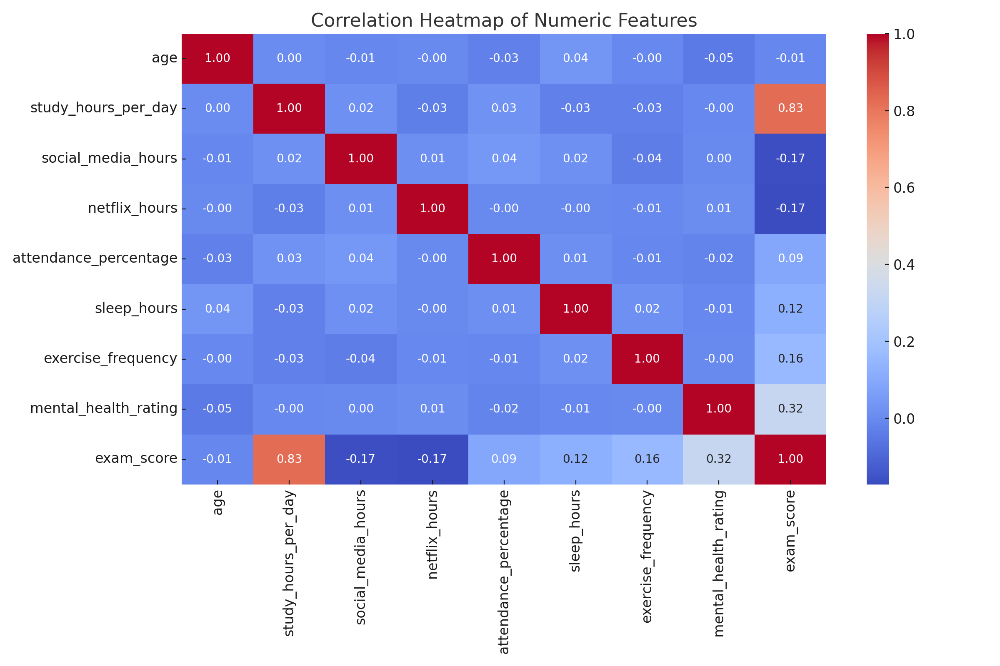
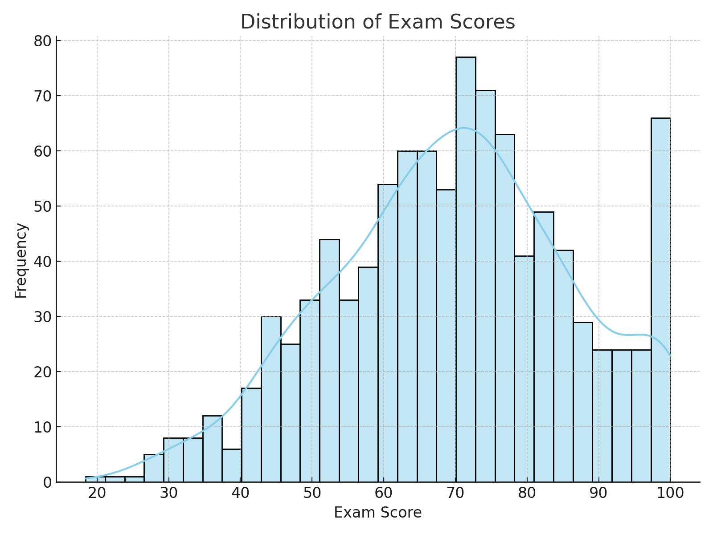
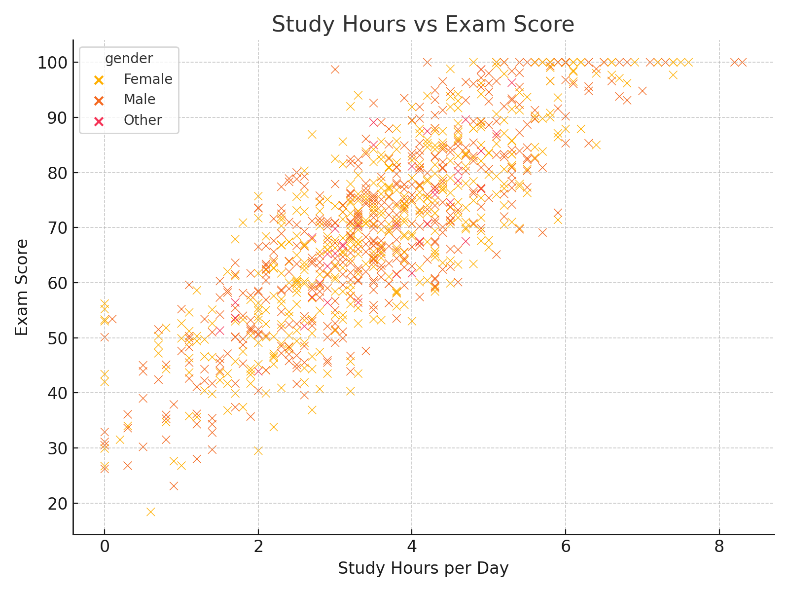

# 📘 Student Performance Prediction

This project uses a machine learning approach to predict student exam scores based on their lifestyle habits such as study hours, social media use, diet, sleep, and more.

## 📂 Dataset Overview

Dataset Link : https://www.kaggle.com/datasets/jayaantanaath/student-habits-vs-academic-performance/data

The dataset contains 1,000 records with the following features:

- **Study Hours, Social Media, Sleep** — daily habits
- **Mental Health Rating, Diet Quality, Exercise Frequency**
- **Parental Education, Internet Quality**
- **Target:** `exam_score`

## 🧠 Objective

To predict the **exam_score** using student habits and behaviors with regression models.

## 📊 Exploratory Data Analysis

### 🔥 Correlation Heatmap


### 📈 Exam Score Distribution


### 📉 Study Hours vs Exam Score


## Machine Learning Workflow 🧪

1. **Data Preprocessing**
   - Label Encoding for categorical features
   - Null value check and cleanup

2. **Model Training**
   - Linear Regression (Best Performing)  
   - Ridge Regression (Best Performing)  
   - Random Forest Regressor  
   - XGBoost Regressor

3. **Evaluation Metrics**
   - MAE, MSE, RMSE  
   - R² Score

4. **Model Saving**
   - Exported the model using `joblib` for future use


## 🚀 How to Run

```bash
# Clone the repository
git clone https://github.com/yourusername/student-performance-prediction.git
cd student-performance-prediction

# Install dependencies
pip install -r requirements.txt

# Run the notebook
jupyter notebook student.ipynb

📦 Requirements
See requirements.txt for all dependencies.
 ```
📌 Author
Sai Ruthvik Munugoti — Data Science Enthusiast

📜 License
This project is licensed under the MIT License.
